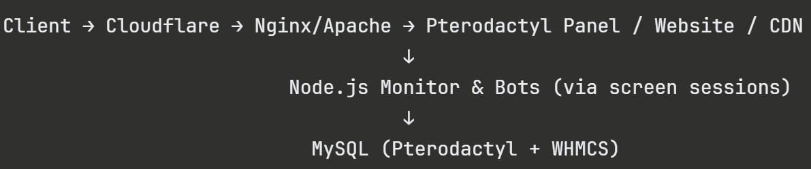

# SapexHosting - Server Infrastructure & Automation
This project contains the server infrastructure, automation scripts, and bots used to run and monitor the SapexHosting game hosting platform at Sapexhosting.dk.


## Features
- Automated process monitoring with self-healing via Overwatch.sh
- Automated SQL backups for Pterodactyl and WHMCS databases with Dropbox sync
- Discord bot for automatic role assignment and word filtering
- Facebook Messenger bot with automated customer support replies (Danish)
- LocalTunnel for exposing local services publicly
- Nginx reverse proxy for the Pterodactyl game panel and CDN
- Apache2 virtual host configuration for the main website
- SSL/TLS via Let's Encrypt on all subdomains

## Architecture Overview


## Components
**Overwatch & Process Monitor**
Overwatch.sh runs in a persistent screen session and checks every 30 seconds whether the DiscordBot, ServerMonitor, LocalTunnel, and FacebookBot screen sessions are alive.

If any process has crashed, it automatically restarts it. 

StartAll.sh bootstraps the entire stack by launching Overwatch.

**Discord Bot**
Built with discord.js v13.

On startup it fetches all guild members and assigns the member role to anyone missing it.

It also assigns the role automatically when new members join, and deletes messages containing words from the configured filter list.

**Configuration — edit config.json:**
```
{
  "token": "<your-bot-token>",
  "filter_list": ["word1", "word2"]
}
```

**Facebook Messenger Bot**
Built with BootBot. 

Provides automated Danish-language replies to common customer questions, such as server access time, CPU specifications, and ECC RAM explanations.

**Configuration** — edit index.js and replace the placeholder values:
```
const bot = new BootBot({
  accessToken: '<your-access-token>',
  verifyToken: '<your-verify-token>',
  appSecret: '<your-app-secret>'
});
```

**SQL Backups**
Two backup scripts run via cron:

- SQLBackup-Pterodactyl.sh — dumps the panel database
- SQLBackup-WHMCS.sh — dumps the WHMCS database

Both compress the dump with gzip, save it to a local folder, and sync to Dropbox using rsync. 
Edit the user, password, folder, and dropbox variables at the top of each script to match your environment.

**Nginx — Pterodactyl Panel** (pterodactyl.conf)
Serves panel.sapexhosting.dk over HTTPS with HTTP → HTTPS redirect. Uses PHP-FPM (PHP 7.4), TLSv1.2/1.3, and standard security headers.

**Nginx — CDN** (cdn_sapexhosting.conf)

Serves cdn.sapexhosting.dk over HTTPS with PHP-FPM support and strict security headers.

**Apache2 — Main Website** (sapexhosting.conf)

Serves sapexhosting.dk and www.sapexhosting.dk over HTTPS using an origin certificate from Cloudflare. Custom 404/403 error pages point to /404.php.

## Technologies
- Node.js / discord.js v13
- Node.js / BootBot (Facebook Messenger)
- Nginx & Apache2
- PHP 7.4 (FPM)
- MySQL / mysqldump
- Pterodactyl Panel
- WHMCS
- Let's Encrypt / SSL
- GNU Screen
- Dropbox + rsync
- LocalTunnel

## Requirements

- Linux (Debian / Ubuntu recommended)
- Node.js 16+
- npm
- MySQL
- Nginx and/or Apache2
- PHP 7.4 (php-fpm)
- GNU Screen (`apt install screen`)
- rsync (`apt install rsync`)
- Dropbox CLI (for backup sync)
- LocalTunnel (`npm install -g localtunnel`)
- Let's Encrypt / Certbot (for SSL)
- Crontab (for scheduled SQL backups)

## Getting started

**Clone the repository /home/yourusername/**
```
git clone https://github.com/Mathias-Skov/SXHosting-Scripts.git
cd SXHosting-Scripts
```

**Install Discord bot dependencies**
```
cd DiscordBot && npm install
```

**Install Facebook bot dependencies**
```
cd FacebookBot && npm install
```

**Make all shell scripts executable**
```
chmod +x *.sh
```

**Start everything**
```
./StartAll.sh
```

**To attach to a running screen session**
```
screen -r DiscordBot
screen -r ServerMonitor
screen -r Overwatch
```

## References

- [Pterodactyl Panel](https://pterodactyl.io/) — Open source game server management panel
- [WHMCS](https://www.whmcs.com/) — Billing and client management platform
- [BootBot](https://github.com/Charca/bootbot) — Facebook Messenger bot framework
- [discord.js](https://discord.js.org/) — Discord bot library
- [LocalTunnel](https://theboroer.github.io/localtunnel-www/) — Expose localhost to the web
- [Certbot](https://certbot.eff.org/) — Let's Encrypt SSL certificates
